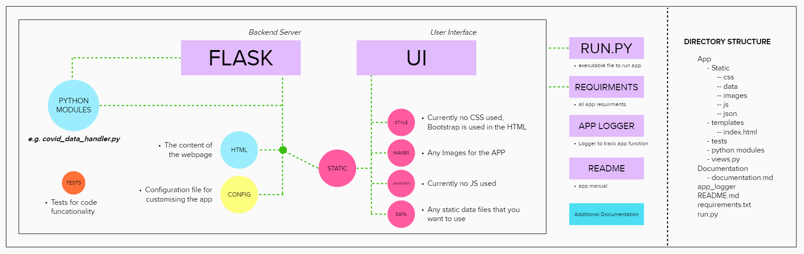
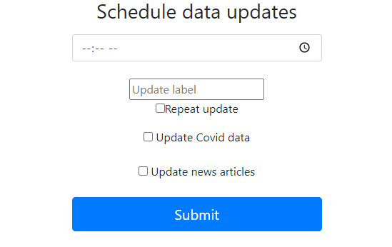
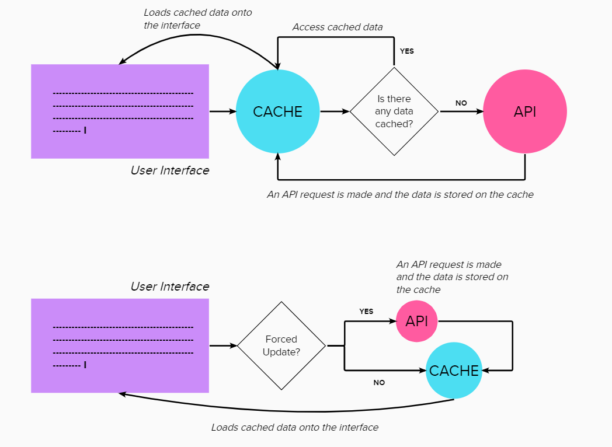
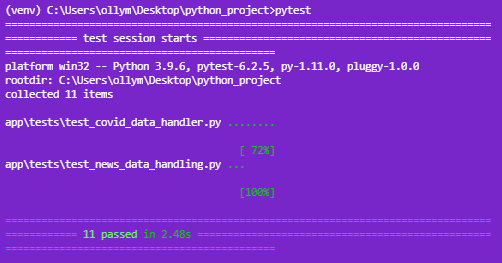

# Automated COVID-19 Tracker 

#### An application that delivers real time updates on covid 19 data and news
---
---
## Introduction

The automated covid-19 tracker project is a application that allows users to keep up to date on 
covid-19 news and data, both nationally and locally. It boasts numerous features such as update 
scheduling, automated updates and the ability to customise features of the app making it
easy to personalise and enhances the user experience.

### API documentation links

#### COVID API [here](https://publichealthengland.github.io/coronavirus-dashboard-api-python-sdk)
#### NEWS API [here](https://newsapi.org/)

---

## Prerequisites 
The app has been packaged in an easy and simple way, to make deployment fast. The diagram below 
shows the structure of the application and its directories. 



Before you begin installing the app, ensure to check you are running the right version of python. 

**VERSION = Python 3.9.6**

```
    python --version 
```
---
## Installation 

A requirments.txt file has been added to allow you to install all the necessary packages at the 
click of a single terminal line code. After downloading a copy of the app, follow these to install 
the requirements 

```
    cd "location of folder"
```
```
    pip3 install -r requirements.txt   

```
It would be advised to run the app on a virtual environment, see below for more details. However 
it is substantial enough to run these lines of code. 

```
    python -m pip install --user virtualenv
```
```
    python -m venv venv/
```
```
    venv\Scripts\activate
```

Once the requirements have been installed and a virtual environment has been set up, 
you can export the app using these commands 

```
    set FLASK_APP = run.py 
```

NOTE: if you are planning to develop further make sure to set the environment to development using 

```
    set FLASK_ENV = development 
```

It is advised during development to run on a virtual environment, see link on more details with setting 
this up
[here](https://docs.python.org/3/library/venv.html)

---
## Getting Started 

Before you run the app it’s important to note the CONFIGURATION file. In the app directory is a 
file called config.json. Inside you will find details of important parameters to be added. The 
main being an API key for the news API. Ensure to add an API key to avoid errors popping up. 

You can also change the other details in the config file if needed.

You can execute the app in the terminal using 

```
    flask run 
```
The app will then start up on your local port. You will need to navigate to http://127.0.0.1:5000/index 
to access the application.

### Scheduling 

In the interface you will notice a big blue submit button, some check boxes above it and a input for 
the update label and title. Enter a time to schedule and update, the name of the update and 
whether you want to repeat or not. Please also select what you want updated, either the news or the data 
or both!



---
## Advanced Details

This python project implements various python libraries and self-created modules. The aim of this section 
is to give a deeper understanding of how the modules work and the logic behind it. This can also be found 
in the documentation folder inside the app. 

#### The modules I plan to discuss are:
- Covid Data and News handlers (specifically caching)
- The views
- The logger 

It is important to remember the directory structure stipulated above. The way I have packaged the app, 
means that it can be run from a single file, so understanding of these module functionalities are 
completely optional.

In addition to this, the code contain inline comments that will aid in your understanding of the 
modules

### Covid Data and News handlers

These handlers are used to pre-process variables we want loaded into the UI. For example you will 
notice a function in the covid_data_handler.py module called process_local_data that takes in 
parameters from the configuration file and returns a local infection rate. Any of the function 
called "process ..." are data processing function. 

In both handlers I have implemented a caching system. Why? well this caching system allows for 
many benefits. As our application is on a regular refresh every 60 seconds, the caching means we
don’t need to call the API request function at every refresh. We simply check if there is data in 
the cache and if there is, then we load it, otherwise we get live data. This is as we only really 
need to call the API request when a user schedules a FORCED DATA UPDATE. The diagram below shows 
this in more detail.



For the actual scheduling aspect, what I have is the same function for both handlers. Essentially,
they check for the user input parameters (update interval and update name). It will then append 
a list item; if it’s a news update it goes in the news list and if it’s a data update it goes in 
the covid data list. The lists are then merged in views.py and rendered on the template. 

To learn more on the python schedule module click [here](https://docs.python.org/3/library/sched.html)

### Views

The views module is like the glue between everything. It connect the front end to all the back end 
processes. Simply put it is used for running the python modules, Accessing user input data and 
sending them to the backend as well as rending everything on the HTML template.

### Logger 

The logger is a small python module that essentially formats the data that we try log. You will 
notice in the other modules code, statements such as:

```
logging.error("error message" **args)
```

These log messages will be stored on an external file called app.log as well as be printed in the 
console, as this is how I’ve set the logger up. This will help you track what and when functions 
are being executed and if any errors occur. 

NOTE: There is a folder called OLD_LOG 

This folder contains logging information for previous stages during the development of this project.
It is intended to be a resource for learning previously encountered errors. 

## Unit Testing and DTC

A series of tests have been implemented in the app to allow for the softwares reliability and longevity 
to be at a higher standard. The tests help to maintain the softwares lifecycle. Each unit test is used
to make sure a function is working. They follow a simple structure of 

1. Arrange - the environment for the test is initialised 
2. Act - a function/feature is executed 
3. Assert - The result of the execution is compared to the actual result

A additional python module was created, run_tests.py. This runs the unit tests at a regular interval 
of 48 hours. This is part of the DTC(see next paragraph) to ensure the software reliability. The 
module cam be run during development, as it is developer focused. 

### DTC - deployment test cycle 

During development a deployment test cycle was used to ensure full functionality of the application.

- Pre-Deployment
    During phase 1 implementation of testing individual functions as they are created using the unit tests. 
    An example of the tests running in phase 1:


- Deployment 
    Proper live deployment was not made, however after completion the app was given a full run through of the 
    tests again to check full functionality
- Post-Deployment 
    Any remaining bugs were fixed 



NOTE: implementing a full software development life cycle would involve repeating these stages, with 
more user testing and a proper deployment phase


## Support

If you are having issues, please let us know. We have a mailing list located at: ollymed77@gmail.com

---

Created by Oliver Medzinskii


